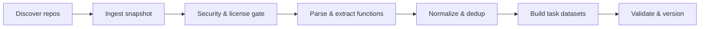

# SLM Data Pipeline (Pilot)

End-to-end dataset builder for code/SLM tasks (completion, documentation, refactor, debugging)

Tech Lead Briefing · v0.1 · 2025-10-31

---

## Agenda

- What we ship and why it matters
- Architecture & flow
- Stage deep-dives (discovery → ingest → security → extract → dedup → tasks → validate)
- Configuration & operations
- Risks, limits, next steps

---

## Outcomes (artifacts we produce)

- Final datasets (JSONL):
  - `data/final/completion.jsonl`
  - `data/final/documentation.jsonl`
  - `data/final/refactor.jsonl`
  - `data/final/debugging.jsonl`
- Provenance & validation:
  - `data/final/manifest.json` (counts, licenses, languages, duplication hint)
  - Security reports in `.reports/security/`
- Intermediates:
  - Snapshots: `data/raw/*.tar.gz`
  - Functions: `data/processed/ast/*_functions.jsonl`

---

## High-level flow



Powered by Prefect tasks with retries and simple caching for discovery.

---

## Orchestration (Prefect)

- Single entry: `pipeline.py` exposes a Prefect `@flow` named "slm-pipeline".
- Each stage is a `@task` wrapper around a focused script.
- CLI flags override `configs.yml` at runtime.

Snippet (pipeline skeleton):

```python
# pipeline.py (excerpt)
@flow(name="slm-pipeline")
def main(..., skip_security: bool = False):
    cfg = load_config(CONFIG_PATH)
    # override cfg with CLI args
    cfg["extract"] |= {"min_function_loc": min_function_loc, "max_function_loc": max_function_loc}
    cfg["dedup"]   |= {"shingle_size": dedup_shingle_size, "minhash_permutations": minhash_perms}

    # Discover or use provided manifest
    manifest_path = t_discover_repos.submit({...}, cfg).result() if not manifest_path else manifest_path
    manifest = json.load(open(manifest_path, "r", encoding="utf-8"))

    # Ingest → Security → Extract per repo
    gated = []
    for item in manifest[:max_repos]:
        snapshot = t_ingest_repo.submit(item, cfg).result()
        gate = snapshot if skip_security else t_security_gate.submit(snapshot, cfg).result()
        if gate.get("status") == "ok":
            gated.append(gate)

    # Normalize+dedup → Build tasks → Validate+version
    norm_info = t_normalize_dedup.submit(Path(cfg["paths"]["ast_dir"]), cfg).result()
    final_info = t_task_transformers.submit(norm_info, cfg).result()
    t_validate_and_version.submit(final_info, norm_info, cfg).result()
```

---

## Discovery (GitHub + GitLab)

- Keyword search on both providers; optional language filters and star threshold.
- Semantic reranking using Sentence-Transformers (cached embeddings). Fallback to stars if model unavailable.
- Produces `manifests/discovered_repos.json` with `semantic_score`, topics, and license hint.

Snippet (semantic filter):

```python
# scripts/repo_discovery.py (excerpt)
emb_items = _embed_texts(model, texts)
emb_query = _embed_texts(model, [semantic_query])
if emb_items is not None and emb_query is not None:
    a = emb_items
    b = emb_query[0] / (np.linalg.norm(emb_query[0]) + 1e-8)
    sims = (a / (np.linalg.norm(a, axis=1, keepdims=True) + 1e-8)) @ b
    items[idx]["semantic_score"] = float(sims[idx])
```

---

## Ingest (snapshot + provenance)

- Shallow clone default branch → tarball snapshot (`*.tar.gz`).
- Compute SHA-256 for each file; capture commit SHA/date.
- Write `provenance.json` with repo metadata and file hashes.

Snippet (provenance build):

```python
# scripts/ingest_repo.py (excerpt)
provenance = {
  'repo_full_name': item['repo_full_name'],
  'commit_sha': sha,
  'commit_date': datetime.utcfromtimestamp(repo.head.commit.committed_date).isoformat(),
  'license_spdx': item.get('license_hint'),
  'scan_tool_versions': {},
  'snapshot_tar': str(tar_path),
  'file_hashes': file_hashes,
}
(Path(work_dir)/'provenance.json').write_text(json.dumps(provenance, indent=2))
```

---

## Security & license gate

- Runs (via Docker when available):
  - ScanCode: license detection (+license text)
  - Semgrep: generic SAST
  - Bandit: Python security
  - Gitleaks: secret leakage
- Decision:
  - License must be in allowlist (e.g., MIT/Apache/BSD)
  - Secrets → quarantine tarball
- Updates `provenance.json` with detected license and scan metadata.

Snippet (license pick):

```python
# scripts/security_scan.py (excerpt)
lic_counts = {}
for f in data.get('files', []):
    for d in f.get('licenses', []):
        spdx = d.get('spdx_license_key') or d.get('key')
        if spdx:
            lic_counts[spdx] = lic_counts.get(spdx, 0) + 1
            if not license_text:
                license_text = d.get('matched_text')
detected_license = max(lic_counts.items(), key=lambda x: x[1])[0] if lic_counts else ingest_hint
```

---

## Parse & extract (functions → JSONL)

- Language: Python (pilot). Parser: `ast`.
- Filters functions by size (LOC) and captures code + docstring.
- Attaches provenance (repo, commit, relative file path, line range).
- Writes `data/processed/ast/<repo>_<sha>_functions.jsonl`.

Snippet (LOC calc + record):

```python
# scripts/parse_extract.py (excerpt)
if isinstance(node, (ast.FunctionDef, ast.AsyncFunctionDef)):
    start, end = node.lineno, getattr(node, 'end_lineno', node.lineno)
    loc = end - start + 1
    if min_loc <= loc <= max_loc:
        results.append({
          'file_path': str(path), 'start_line': start, 'end_line': end,
          'loc': loc, 'code': snippet, 'docstring': ast.get_docstring(node)
        })
```

---

## Normalize & deduplicate

- Normalization (Python): trim trailing spaces, collapse blank lines, deterministic newline.
- Exact dedup: BLAKE3 over normalized code.
- Near-dup: MinHash LSH over token shingles (k=7 default) to drop lookalikes.
- Output: `data/processed/ast/kept_records.jsonl` and stats.

Snippet (near-dup):

```python
# scripts/normalize_dedup.py (excerpt)
m = MinHash(num_perm=perms)
for s in shingles: m.update(s.encode('utf-8'))
lsh.insert(str(idx), m)
# keep first in each neighborhood
neighbors = lsh.query(m)
for n in neighbors:
    j = int(n)
    if j != i: dropped.add(j)
```

---

## Task datasets (4 tasks)

- Completion: prefix → completion (N ∈ {1,3,10} lines)
- Documentation: code + docstring (or heuristic summary)
- Refactor: formatting diff (Black if available); pre/post + unified diff
- Debugging: inject tiny bug; pair (buggy → fixed) + diff

Snippet (completion record):

```python
# scripts/task_transformers.py (excerpt)
out = {
  'task': 'completion',
  'language': rec.get('language'),
  'license': rec.get('provenance', {}).get('license_spdx'),
  'provenance': rec.get('provenance'),
  'input': {'prefix': prefix},
  'output': {'completion': completion},
}
```

---

## Validation & versioning

- JSON Schema validation (Draft-07) per task + a shared `provenance.schema.json`.
- Builds `data/final/manifest.json` with counts, license and language distributions, and duplication hint.

Snippet (validate):

```python
# scripts/validate_and_version.py (excerpt)
Draft7Validator(schema, resolver=resolver).validate(rec)
if task in ('completion','documentation','refactor'):
    Draft7Validator(prov_schema, resolver=resolver).validate(rec['provenance'])
```

---

## Configuration & CLI

- Defaults: `slm-pipeline/configs.yml`
- Runtime overrides via CLI flags (e.g., `--max-repos`, `--semantic-threshold`, `--min-function-loc`)
- Key knobs:
  - Discovery: `semantic.model`, `semantic.topk`, `semantic.threshold`, `min_stars`
  - Extract: `min_function_loc`, `max_function_loc`
  - Dedup: `shingle_size`, `minhash_permutations`, `lsh_threshold`

Example:

```bash
python pipeline.py \
  --max-repos 5 --min-stars 50 \
  --semantic-query "graph algorithms" --semantic-threshold 0.72 \
  --min-function-loc 5 --max-function-loc 300 \
  --dedup-shingle-size 7 --minhash-perms 128
```

---

## Paths & layout (selected)

- Raw snapshots: `data/raw/`
- Functions: `data/processed/ast/`
- Final datasets: `data/final/`
- Manifests: `manifests/`
- Security reports: `.reports/security/`

DVC stage present for convenience (`dvc.yaml`).

---

## Operations

- Runtime: Python 3.10–3.12; Prefect orchestrates retries.
- Discovery auth (optional): set `GH_TOKENS` and/or `GL_TOKEN` in `.env`.
- Security scans use Docker; on Windows, run inside WSL2 for best compatibility.
- Parallelism knobs: `worker_parallelism` (reserved for future test execution).

---

## Risks & limits

- Language support: Python only in pilot (tree-sitter hook points are present but unused).
- License detection depends on ScanCode; when Docker is unavailable, we fallback to ingest hint.
- Near-dup LSH can occasionally over/under-cluster; k/perms/threshold are tunable.
- Synthetic tasks (refactor/debugging) are minimal by design; expandability planned.

---

## Next steps (roadmap)

- Add multi-language parsing via tree-sitter; extract classes/tests.
- Enrich documentation task with model-generated summaries (opt-in, license-aware).
- Stronger debugging tasks using test harnesses and failure signals.
- CI gates for duplication, schema, and license checks (toggle via `ci.*`).

---

## Try it

- Minimal run (single repo, no strict stars):

```bash
python pipeline.py --max-repos 1 --min-stars 0 --languages python \
  --keyword-query "license:mit python"
```

- View outputs in `data/final/` and `data/processed/ast/kept_records.jsonl`.

In Obsidian: open this file and start Presentation mode (Slides). Slides are separated with `---`.
